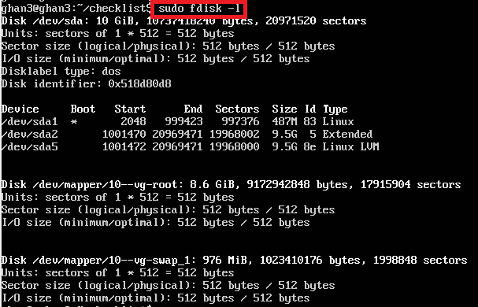
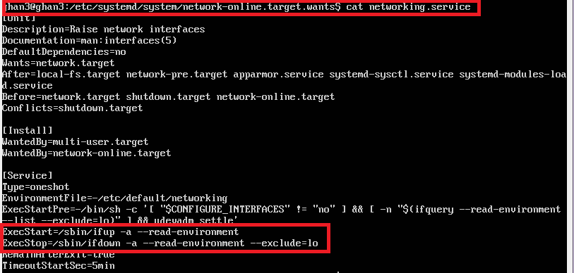

## Linux服务器系统管理基础

### 动手实战Systemd

#### 命令篇

* [由来-Systemd概述-系统管理](https://asciinema.org/a/8MhY6ovZh8Nmjvk5dhHEGhH9q)   
* [Unit](https://asciinema.org/a/wBcUWnoSNYb0xxqNJBn8QI1uC)   
* [Unit的配置文件](https://asciinema.org/a/xBi8pjHTnGMTe9uQwJL2TASap)
* [Target](https://asciinema.org/a/YT9z34NdaN4cjaJticlb3zSwo)
* [日志管理](https://asciinema.org/a/zjXj7WYAWVo2Z4Pyd4ZWEKmg5)

### 实战篇

* [Systemd实战](https://asciinema.org/a/o3DtFpikriHvS2FdEP6cYO1gF)

### 自查清单

1. [如何添加一个用户并使其具备sudo执行程序的权限？](https://asciinema.org/a/wAN468FnMJwrndyroHWxxHuap)

2. [如何将一个用户添加到一个用户组？](https://asciinema.org/a/5h5AdD3mQVPD9oNnuy9QKdERX)

3. 如何查看当前系统的分区表和文件系统详细信息？   
   

4. 如何实现开机自动挂载Virtualbox的共享目录分区？      
   在 /etc/fstab 文件末添加一项    
`sharing /mnt/share vboxsf defaults 0 0`   

5. [基于LVM（逻辑分卷管理）的分区如何实现动态扩容和缩减容量？](https://asciinema.org/a/ZvLUIqtVM1RQVzEZiPXwyThVQ)

6. 如何通过systemd设置实现在网络连通时运行一个指定脚本，在网络断开时运行另一个脚本？    
修改配置文件`/etc/systemd/system/network-online.target.wants/networking.service`中的`ExecStart`和`ExecStop`
   

7. 如何通过systemd设置实现一个脚本在任何情况下被杀死之后会立即重新启动？实现杀不死？   
修改该脚本的配置文件，设置`Restart:always`
