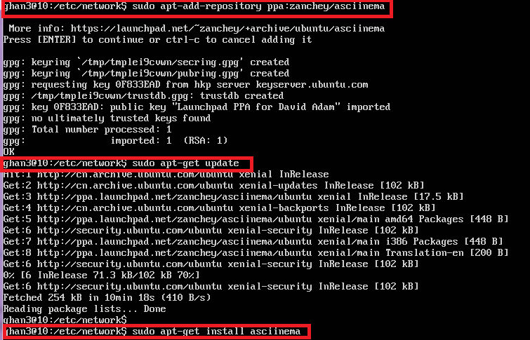
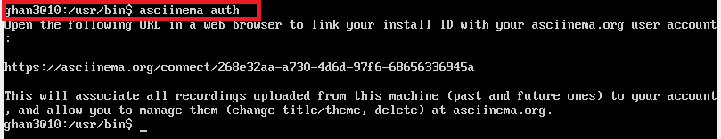

# 第二章实验：vimtutor学习

## 配置asciinema

- 安装asciinema
```shell
sudo apt-add-repository ppa:zanchey/asciinema
sudo apt-get update
sudo apt-get install asciinema
```


- 关联asciinema

```shell
asciinema auth
```


## 学习vimtutor

[第一节学习视频](https://asciinema.org/a/AsHqXoMjVseN83FocairetJs7)

[第二节学习视频](https://asciinema.org/a/li9pO2v0phCIuM3Fi2S3QUlBw)

[第三节学习视频](https://asciinema.org/a/fSYi7b7uvcpAYmt5cPrvw5GSu)

[第四节学习视频](https://asciinema.org/a/6tLOC0EC1HSRCEHdCjdPEXxSK)

[第五节学习视频](https://asciinema.org/a/3oRWzQ489KAx2snfdC0vTJvq5)

[第六节学习视频](https://asciinema.org/a/SZnV98Z6LwkXWkcqEA7gOjPln)

[第七节学习视频](https://asciinema.org/a/FiescWGBOWQZlfOp0eCpqhKbO)

## 自查清单   

- 你了解vim有哪几种工作模式？      
一般模式(Normal Mode):按`esc`键由其他模式到一般模式    
编辑模式(Insert Mode)：一般模式按下i/I/o/O等进入编辑模式   
可视化模式(Visual Mode):`Ctrl+V`进入可视化模式
命令行模式(Ed Mode)：一般模式输入`:`

- Normal模式下，从当前行开始，一次向下移动光标10行的-操作方法？如何快速移动到文件开始行和结束行？如何快速跳转到文件中的第N行？   
下移光标十行：`10g`   
快速移动到文件开始行：`gg`   
移动到文件结束行：`G`    
移动到文件中的第N行：`N G`

- Normal模式下，如何删除单个字符、单个单词、从当前光标位置一直删除到行尾、单行、当前行开始向下数N行？    
删除单个字符：`x`   
删除单个单词：`dw`     
从当前光标删除到行尾：`d$`   
删除单行：`dd`   
删除从当前行下数N行：`Ndd`   

- 如何在vim中快速插入N个空行？如何在vim中快速输入80个-？   
插入N个空行：`No`   
输入80个-：`80i- esc`

- 如何撤销最近一次编辑操作？如何重做最近一次被撤销的操作？    
撤销最近一次编辑操作：`u`   
重做最近一次被撤销的操作：`Ctrl+R`

- vim中如何实现剪切粘贴单个字符？单个单词？单行？如何实现相似的复制粘贴操作呢？   
  * 剪切粘贴   
  单个字符`d  p`   
  单个单词`dw  p`    
  单行`dd p`   
  * 复制粘贴   
  进入visul模式选中要进行复制的内容，退出到Normal模式后，按下p进行粘贴   


- 为了编辑一段文本你能想到哪几种操作方式（按键序列）？    
   1. vim+文件名
   2. 按下i，进行文本编辑
   3. 文本编辑结束后，按下esc进入到Normal模式
   4. 按下:wq保存并退出


- 查看当前正在编辑的文件名的方法？查看当前光标所在行的行号的方法？   
查看文件名或光标所在行号：`Ctrl+G`

- 在文件中进行关键词搜索你会哪些方法？如何设置忽略大小写的情况下进行匹配搜索？如何将匹配的搜索结果进行高亮显示？如何对匹配到的关键词进行批量替换？       
关键词搜索：`/word`    
忽略大小写匹配搜索：`:set ic`   
搜索结果高亮显示：`set hls is`   
匹配结果批量替换：`:s/old/new/g`   

- 在文件中最近编辑过的位置来回快速跳转的方法？
向前：`Ctrl+O`     
向后：`Ctrl+I`

- 如何把光标定位到各种括号的匹配项？例如：找到(, [, or {对应匹配的),], or }    
将光标移动到该括号，按下%

- 在不退出vim的情况下执行一个外部程序的方法？   
`:!+命令`

- 如何使用vim的内置帮助系统来查询一个内置默认快捷键的使用方法？如何在两个不同的分屏窗口中移动光标？
帮助系统使用：`:help`       
分屏窗口移动光标：`Ctrl+W`

## 参考链接

[vimtutor官网](https://asciinema.org/docs/getting-started)
