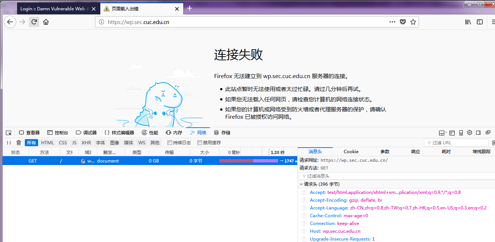

# 实验五 Web服务器配置   

## 环境搭建（基本要求）

### 使用虚拟机环境       
  * ubuntu-server1     
    * ubuntu 16.04    
    * VeryNginx(80端口)
    * Nginx(8080端口)
    * host-only：192.168.56.105         


  * ubuntu-server2
    * ubuntu 16.04
    * wordpress
    * host-only:192.168.56.103      


  * ubuntu-server3         
    * ubuntu 16.04
    * dvwa
    * host-only:192.168.56.104     


  * 注：以上仅标注了实验中用到的网卡及地址


### 安装VeryNginx       

* [参考中文文档](https://github.com/alexazhou/VeryNginx/blob/master/readme_zh.md)     

* 具体安装过程      

```
git clone https://github.com/alexazhou/VeryNginx.git   
sudo apt install libssl-dev libpcre3 libpcre3-dev build-essential   
cd VeryNginx   
sudo python install.py install

sudo adduser VeryNginx
sudo /opt/verynginx/openresty/nginx/sbin/nginx
```

* 安装成功        

   

* 同时配置Nginx和VeryNginx
  * Nginx端口为8080
  

### 安装WordPress   

* [安装LAMP](https://www.digitalocean.com/community/tutorials/how-to-install-linux-apache-mysql-php-lamp-stack-on-ubuntu-16-04)    

* [安装WordPress](https://www.digitalocean.com/community/tutorials/how-to-install-wordpress-with-lamp-on-ubuntu-16-04)

* 安装成功并实现通过域名访问

   

* 对外提供访问地址https://wp.sec.cuc.edu.cn    

  * [配置参考资料](https://www.digitalocean.com/community/tutorials/how-to-create-a-self-signed-ssl-certificate-for-apache-in-ubuntu-16-04)

  * 配置成功截图    

  


### 安装DVWA   

* [参考安装视频](https://www.youtube.com/watch?v=5BG6iq_AUvM)

* 安装成功并实现通过域名访问


### 设置反向代理    

* verynginx配置截图    

     

     

* hosts文件截图    

    

* dvwa反向代理成功截图     

    

* wordpress设置反向代理    
  * 配置未生效，显示无法连接
      

  * 将虚拟机恢复至配置https之前快照，显示连接超时。
  * 将对应的两个weight值分别修改为0/1，显示连接超时。
  * 删除http对应反向代理设置，显示连接超时。
  * wordpress反向代理配置失败。    
  * 最终解决方案，重新搭建wordpress，仅提供对http的访问以完成下面实验。

## 安全加固要求（未完成）

* 使用IP地址方式均无法访问上述任意站点，并向访客展示自定义的友好错误提示信息页面-1         


* Damn Vulnerable Web Application (DVWA)只允许白名单上的访客来源IP，其他来源的IP访问均向访客展示自定义的友好错误提示信息页面-2     

* 在不升级Wordpress版本的情况下，通过定制VeryNginx的访问控制策略规则，热修复WordPress < 4.7.1 - Username Enumeration     

* 通过配置VeryNginx的Filter规则实现对Damn Vulnerable Web Application (DVWA)的SQL注入实验在低安全等级条件下进行防护      

## verynginx配置要求（未完成）

* VeryNginx的Web管理页面仅允许白名单上的访客来源IP，其他来源的IP访问均向访客展示自定义的友好错误提示信息页面-3     

* 通过定制VeryNginx的访问控制策略规则实现：    
  * 限制DVWA站点的单IP访问速率为每秒请求数 < 50    
  * 限制Wordpress站点的单IP访问速率为每秒请求数 < 20    
  * 超过访问频率限制的请求直接返回自定义错误提示信息页面   
  * 禁止curl访问
