## 第四章实验：shell脚本编程基础

### 任务一 编写一个图片批处理脚本
[任务一代码](task1.sh)

* 帮助手册   
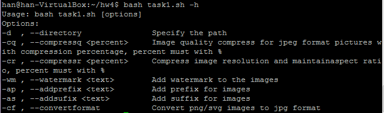

* 支持对jpeg格式图片进行图片质量压缩   
`bash task1.sh -d ./image/ -cq 50%`        
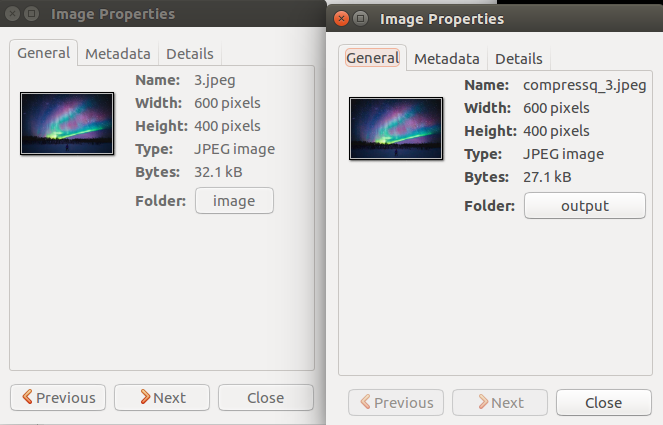

* 支持对jpeg/png/svg格式图片在保持原始宽高比的前提下压缩分辨率   
`bash task1.sh -d ./image/ -cr 50%`     
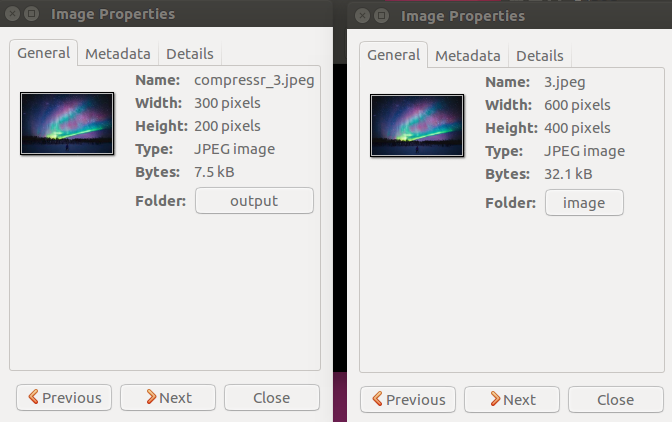

* 证明为批量处理     
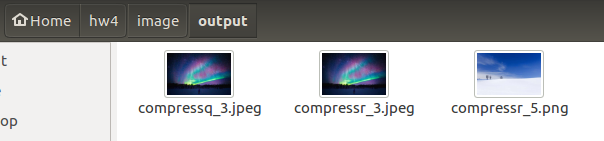

* 支持对图片批量添加自定义文本水印     
`bash task1.sh -d ./image/ -wm "watermark"`      
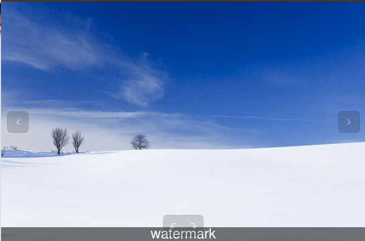

* 支持批量重命名（统一添加文件名前缀或后缀，不影响原始文件扩展名）     
`bash task1.sh -d ./image/ -ap "test"`     
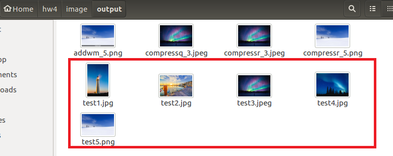   
`bash task1.sh -d ./image/ -as "test"`     
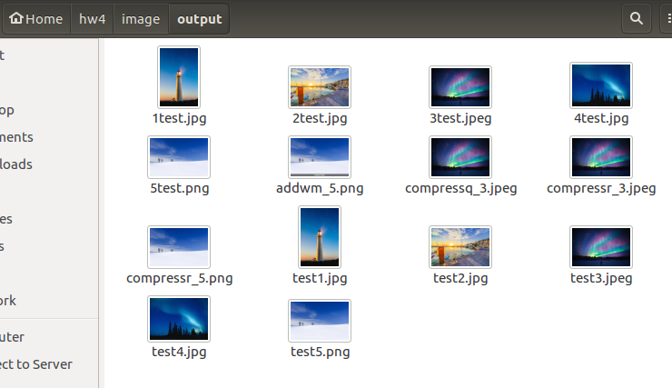

* 支持将png/svg图片统一转换为jpg格式图片   
`bash task1.sh -d ./image/ -cf`     
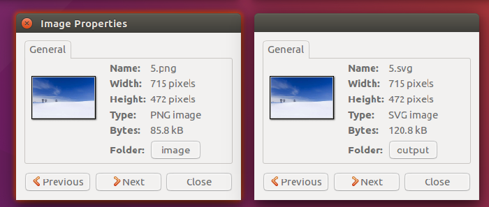

### 任务二 运动员数据处理
[任务二代码](task2.sh)

* 帮助手册   
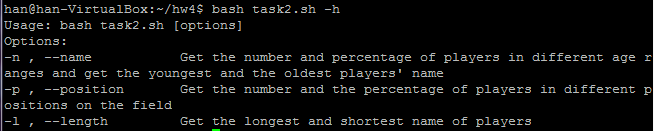

* 统计不同年龄区间范围（20岁以下、[20-30]、30岁以上）的球员数量、百分比
* 年龄最大的球员是谁？年龄最小的球员是谁？     
`bash task2.sh -n`    
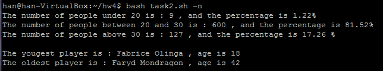

* 统计不同场上位置的球员数量、百分比       
`bash task2.sh -p`       
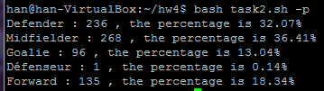

* 名字最长的球员是谁？名字最短的球员是谁？   
`bash task2.sh -l`   
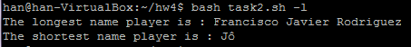

### 任务三 处理Web服务器访问日志
[任务三代码](task3.sh)

* 帮助手册     
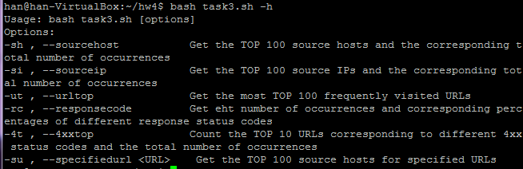

* 统计访问来源主机TOP 100和分别对应出现的总次数     
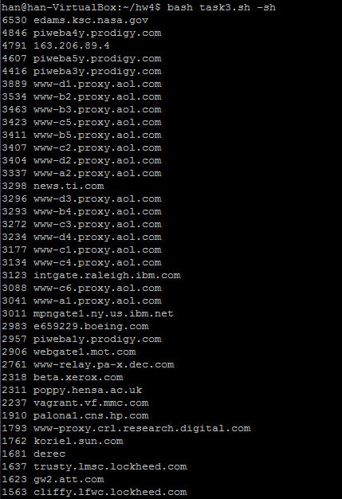

* 统计访问来源主机TOP 100 IP和分别对应出现的总次数      
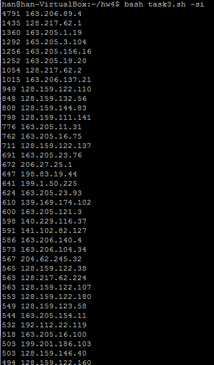

* 统计最频繁被访问的URL TOP 100       
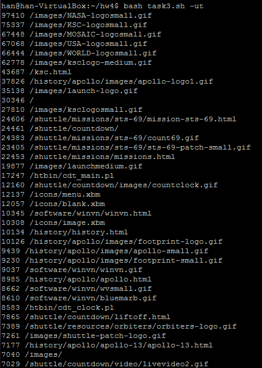

* 统计不同响应状态码的出现次数和对应百分比       
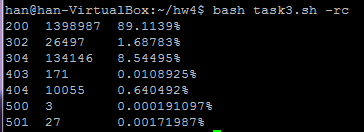

* 分别统计不同4XX状态码对应的TOP 10 URL和对应出现的总次数      
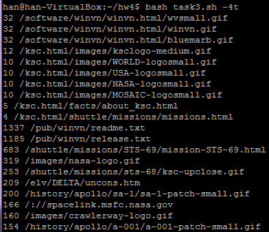

* 给定URL输出TOP 100访问来源主机     
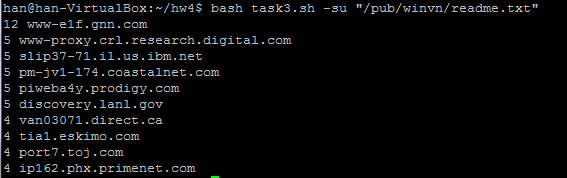
